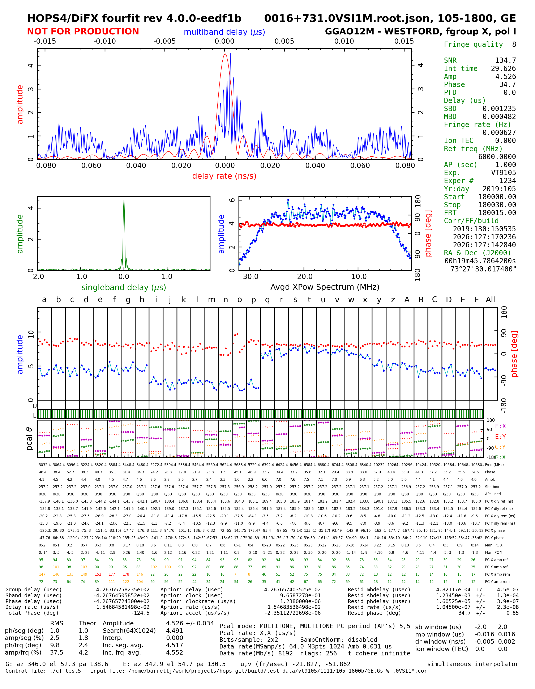

Quick Start Guide - Fringe Fitting in HOPS4
===========================================

This quick start guide walks through a basic fringe-fitting example using the ``vt9105``
VGOS test dataset. By the end you will have run ``fourfit4`` on a single
baseline, produced a fringe file, and inspected the plot and results.

Prerequisites
-------------

* HOPS4 installed (with plotting enabled via gnuplot or python-matplotlib) and the environment sourced:

  .. code-block:: bash

     source <hops-install>/bin/hops.bash

* The ``vt9105`` test dataset downloaded. To obtain the test data archives run: 

  .. code-block:: bash

     testdata_download_all.sh

  This will place the data under ``<hops-install>/data/test_data/``.
  You can then unpack it with:

  .. code-block:: bash

     cd <hops-install>/data/test_data/
     tar -xzvf ./vt9105.tar.gz

  Then set a shell variable for convenience:

  .. code-block:: bash

     DATADIR=<hops-install>/data/test_data/vt9105
     cd $DATADIR

Data Directory Layout
---------------------

HOPS4 organizes correlation data in a two-level hierarchy (experiment, scan) which looks like::

  <experiment-number>/
    <scan-directory>/
      <source>.root.json      # scan metadata
      <baseline>.cor          # correlator output (one per baseline)
      <station>.sta           # station data (one per station)

This is the same structure that was use by the Mark4 format, though the binary data format is entirely different.
As an example of the Mark4 directory structure, the ``vt9105`` dataset contains Mark4-format data in the 
experiment directory ``1234`` which looks like::

  vt9105/
    cf_test5                 # control file for this experiment
    1234/
      105-1800/              # scan: day 105, 18:00 UTC
        0016+731.0VSI1M      # mark4 root (ovex) metadata 
        G..0VSI1M            # mark4 station (G) data 
        E..0VSI1M            # mark4 station (E) data
        GE..0VSI1M           # mark4 baseline (GE) visibility data
        ...

Where the directory ``105-1800`` is the HOPS scan directory (named by: day-of-year 105, start time 18:00 UTC).
This date-time naming convention is typical for VGOS/geodesy, but is not required by the format. The ``GE..`` file 
contains the visibility data associated with the baseline between stations G (Goddard) and E (Westford), whereas the ``E..`` and 
``G..`` files contain the station data (delay models, etc.).

Step 1: Convert Mark4 Data to HOPS4 Format
-------------------------------------------

Since ``fourfit4`` reads the new HOPS4 ``.cor``/``.sta`` file format, the first step in this example is
to use ``mark42hops`` to convert the Mark4 data in ``1234/105-1800`` to  the HOPS4 format, writing output into ``1111/105-1800b``:

.. code-block:: bash

   mkdir -p ./1111
   mark42hops -i ./1234/105-1800 -o ./1111/105-1800b

``mark42hops`` reads every baseline and station file from the Mark4 scan
directory and writes the equivalent HOPS4 ``.cor``, ``.sta``, and
``.root.json`` files to the output directory. This produces::

  vt9105/
    1111/
      105-1800b/                    # scan: day 105, 18:00 UTC
        0016+731.0VSI1M.root.json   # hops4 metadata 
        G.Gs.0VSI1M.sta             # hops4 station (G) data 
        E.Wf.0VSI1M.sta             # hops4 station (E) data 
        GE.Gs-Wf.0VSI1M.cor         # mark4 baseline (GE) visibility data
        ...

.. note::

   The experiment vt9105 also contains .difx output. If you have the DiFX difxio library available and have 
   enabled ``HOPS_USE_DIFXIO=ON``, you can use ``difx2hops`` instead to produce HOPS4 data directly from the DiFX files.
   This is the standard path for processing data in HOPS4 (conversion from the Mark4 format is provided for backwards compatibility).

.. note::
   ``fourfit4`` expects data in the HOPS4 format. However, the ``-K`` (uppercase) flag can be passed to ``fourfit4`` to
   tell it to consume mark4 formatted data directly. This is recommended only for quick one-off inspection, as it requires
   a temporary data copy (in ``/dev/shm`` if available, otherwise ``/tmp``) to do the conversion from the Mark4 to HOPS4 format. This is not as efficient as
   pre-converting the data. Similarly, ``fourfit4`` will generate output in the HOPS4 format. However, the user may
   pass the ``-k`` (lowercase) flag which will cause fourfit4 to generate legacy Mark4 fringe output files
   (e.g. GE.X.1.0VSI1M) instead of HOPS4 format ``.frng`` files irrespective of the input format.

Step 2: The Control File
------------------------

The ``fourfit`` control file sets fringe-search parameters and per-station calibration
values. The test dataset includes a file: ``cf_test5`` which is configured for this
experiment. Some of the key global parameters are:

.. code-block:: none

   sb_win -6.0 6.0          * single-band delay search window (us)
   dr_win -5.e-6  5.e-6     * delay-rate search window (s/s)

   pc_mode  multitone        * multi-tone phase calibration
   pc_period 5               * phase-cal extraction period (s)

   mbd_anchor sbd            * anchor multi-band delay to SBD solution
   samplers 4 abcdefgh ijklmnop qrstuvwx yzABCDEF
                             * 4 samplers, 8 channels each (32 total)
   ref_freq 6000.0           * reference frequency (MHz)

The file also contains additional conditional ``if station <X>`` blocks with per-station sampler
delays and manual phase-cal phases derived from a prior processing pass, used to align delay and phase across all four VGOS frequency bands.

Step 3: Run fourfit4
---------------------

.. note::

   ``fourfit4 --help`` will print a usage description of all of the command line arguments supported by fourfit4

Run ``fourfit4`` to fringe-fit the GE baseline visibility data, generating a pseudo-Stokes-I polarization 
(a normalized sum of XX, YY, XY, YX polarization products) fringe file:

.. code-block:: bash

   fourfit4 -m -2 -c ./cf_test5 -b GE -P I ./1111/105-1800b/

Key options:

.. list-table::
   :widths: 15 85

   * - ``-m -2``
     - Message level -2 (debug-level output).
   * - ``-c ./cf_test5``
     - Control file to use.
   * - ``-b GE``
     - Process only the GE baseline (omit to process all baselines).
   * - ``-P I``
     - Polarization product: ``I`` forms pseudo-Stokes I from the
       XX, YY, XY, and YX products. Use ``XX``, ``YY``, ``XY``, or ``YX`` for
       individual products.

After running this command you will have a new ``.frng`` file in the scan directory alongside the .sta and .cor files.

.. code-block:: bash

   ls ./1111/105-1800b/*frng*
   ./1111/105-1800b/GE.Gs-Wf.X.I.0VSI1M.1.frng

Step 4: Understanding the Output Filename
-----------------------------------------

HOPS4 fringe files follow the naming convention::

  <baseline>.<ref-code>-<rem-code>.<band>.<pol>.<root-code>.<n>.frng

For the file above:

.. list-table::
   :widths: 22 78

   * - ``GE``
     - Baseline: stations G (Goddard) and E (Westford).
   * - ``Gs-Wf``
     - Station codes from the VEX file.
   * - ``X``
     - Frequency band.
   * - ``I``
     - Polarization product (pseudo-Stokes I) (could also be XX, YY, XY, YX, RR, LL, etc.).
   * - ``0VSI1M``
     - Root code: a short 6-char identifier for the scan derived from the creation time.
   * - ``1``
     - Sequential fringe index (incremented for each additional fringe file in the scan directory).
   * - ``.frng``
     - HOPS4 fringe file (binary data).

.. note::

   ``fourfit4`` will not overwrite previously generated ``.frng`` files
   (even if the exact same command/control parameters as used in a previous
   run were passed). Instead it will generate a new ``.frng`` file with the
   sequence number incremented by one. Use the ``-t`` option to run a fringe
   fitting pass without writing output.

Step 5: Inspect the Result
---------------------------

**Fringe plot.** Display a fringe plot:

.. code-block:: bash

   fplot4 ./1111/105-1800b/GE.Gs-Wf.X.I.0VSI1M.1.frng

   Example fringe plot generated by ``fplot4``.

The default plotting backend for fplot4 is the gnuplot based system, which generates a fast, but static, plot. However, if you 
have the python dependencies installed, you can change the plotting backend to matplotlib by using ``-B matplotlib``. 
In addition, plots can be created directly while running fourfit by passing the ``-p`` option. 

**JSON export.** Convert the fringe file to JSON for direct data inspection:

.. code-block:: bash

   hops2json ./1111/105-1800b/GE.Gs-Wf.X.I.0VSI1M.1.frng

This produces the file ``GE.Gs-Wf.X.I.0VSI1M.1.frng.json`` containing the
full fringe data and metadata in json format. 

.. note::

   ``hops2json --help`` describes the usage options of this conversion utility, which can also be used on ``.cor`` and ``.sta`` files.

From the JSON file you can then extract fringe data and related quantities using the command 
line tool ``jq`` (See: `<https://jqlang.org/>`_). For example, the following:

.. code-block:: bash

   jq '.[].tags.plot_data | select( . != null )' ./1111/105-1800b/GE.Gs-Wf.X.I.0VSI1M.1.frng.json

will dump a json blob containing all of the plot data in the fringe file to stdout. 

For more in-depth command-line exploration, use a tool like ``jless`` (From: `<https://jless.io/>`_) to interactively navigate the 
file structure. 

.. only:: html

   .. figure:: ../images/jless-optimized.gif
      :alt: jless navigation demo on HOPS4 data
      :align: center
      :width: 100%

      Navigating a nested HOPS4 fringe file (converted to .json) structure with ``jless``.

.. only:: not html

   .. figure:: ../images/jless-optimized.png
      :alt: jless navigation demo on HOPS4 data
      :align: center
      :width: 100%

      Navigating a nested HOPS4 fringe file (converted to .json) structure with ``jless``.

For more complicated data-inspection tasks for which performance is not a concern, you can also load a .json file directly into 
a python dictionary via:

.. code-block:: python

   import json
   fringe_file = "./1111/105-1800b/GE.Gs-Wf.X.I.0VSI1M.1.frng.json"

   # Open and parse the JSON file
   with open(fringe_file, "r") as f:
       data = json.load(f)

   # 'data' is now a Python dictionary
   print(data)

**A-format summary.** In addition, you can also generate an alist-style summary of all HOPS4 fringe files in the scan directory with:

.. code-block:: bash

   alist4 -o ./alist.out ./1111/105-1800b/*.frng

Next Steps
----------

* Run ``fourfit4`` with ``-P XX`` or ``-P YX`` to process a single polarization product.
* Run ``fourfit4`` with ``-pt`` to generate an on-the-fly plot but without creating any fringe files.
* Run ``fourfit4`` without ``-b GE`` to process all baselines in the scan in sequence.
* Adjust ``sb_win`` and ``dr_win`` in the control file to change the search range.
* See the :doc:`../developer_guide/user_plugin` guide for writing Python plugins to customize calibration/post-processing.
* See the :doc:`../developer_guide/control_keyword_reference` for a complete list of control file keywords.
